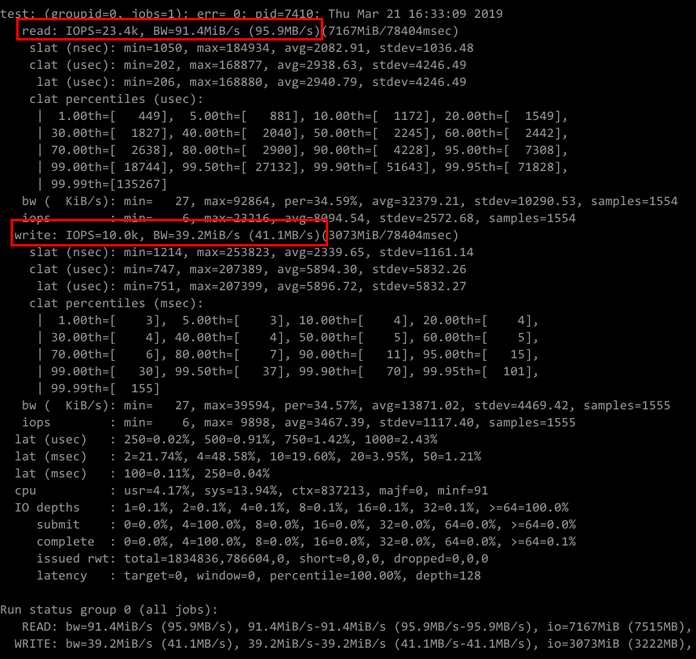
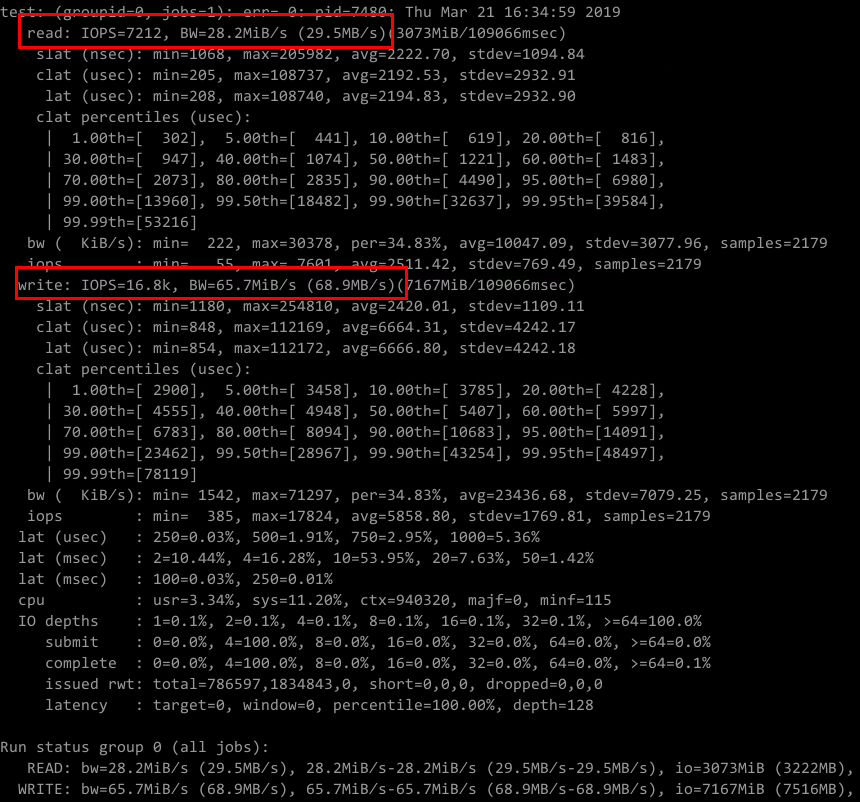
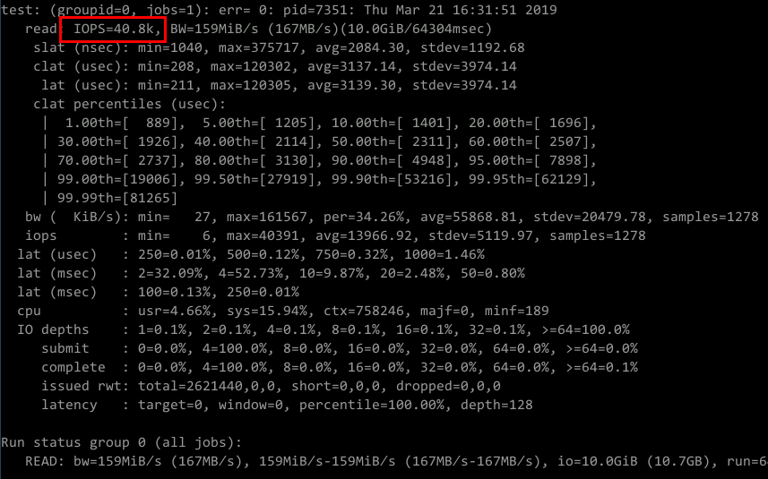
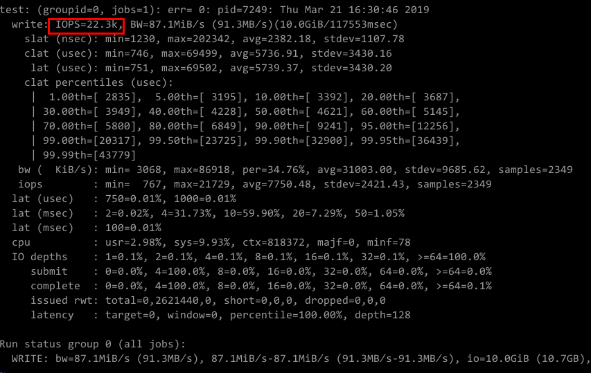
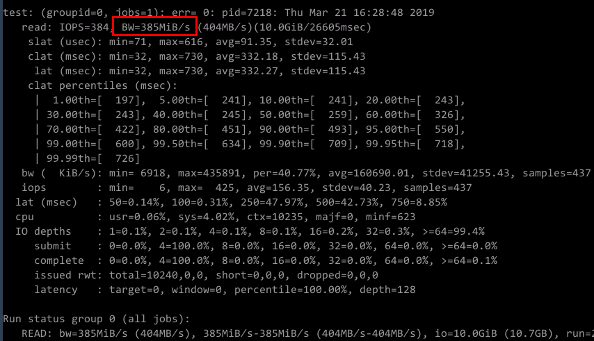
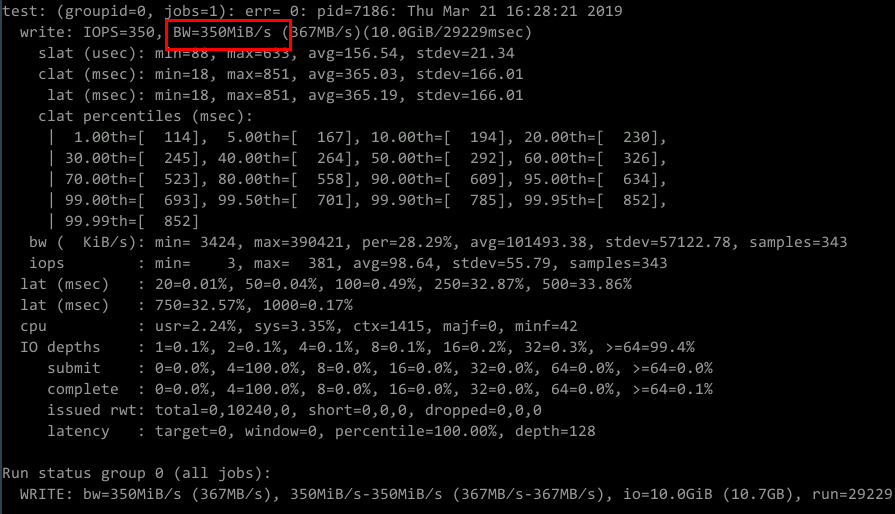

# SFS Turbo性能测试

fio是一个开源的I/O压力测试工具，可以使用 fio工具对SFS进行吞吐和 IOPS 的性能测试。

## 前提条件

已在云服务器上安装fio工具。fio可从[官网](http://freecode.com/projects/fio)或[GitHub](https://github.com/axboe/fio.git)下载。

## 注意和说明

测试性能依赖client和server之间的网络带宽。

## 安装fio

以Linux CentOS系统为例说明：

1.  在官网下载fio。

    **yum install fio**

2.  安装libaio引擎。

    **yum install libaio-devel**

3.  查看fio版本。

    **fio --version**

## 通用测试配置样例

本文以SFS Turbo性能型，云服务器规格如下为例说明，容量型测试数据参考官方文档。

规格：通用计算增强型 | c3.xlarge.4 | 4vCPUs | 16GB

镜像：CentOS 7.564bit

**混合读写，读写比例7:3**

-   fio命令：

    **fio --randrepeat=1 --ioengine=libaio --name=test -output=output.log --direct=1 --filename=_/mnt/nfs/test\_fio_  --bs=4k --iodepth=128 --size=10240M --readwrite=rw --rwmixwrite=30 --fallocate=none**

-   fio结果：

    

**混合读写，读写比例3:7**

-   fio命令：

    **fio --randrepeat=1 --ioengine=libaio --name=test -output=output.log --direct=1 --filename=_/mnt/nfs/test\_fio_  --bs=4k --iodepth=128 --size=10240M --readwrite=rw --rwmixwrite=70 --fallocate=none**

-   fio结果：

    

**读IOPS**

-   fio命令：

    **fio --randrepeat=1 --ioengine=libaio --name=test -output=output.log --direct=1 --filename=_/mnt/sfs-turbo/test\_fio_  --bs=4k --iodepth=128 --size=10240M --readwrite=read --fallocate=none**

-   fio结果：

**写IOPS**

-   fio命令：

    **fio --randrepeat=1 --ioengine=libaio --name=test -output=output.log --direct=1 --filename=_/mnt/sfs-turbo/test\_fio_  --bs=4k --iodepth=128 --size=10240M --readwrite=write--fallocate=none**

-   fio结果：

    

**读带宽**

-   fio命令：

    **fio --randrepeat=1 --ioengine=libaio --name=test -output=output.log --direct=1 --filename=_/mnt/sfs-turbo/test\_fio_  --bs=1M --iodepth=128 --size=10240M --readwrite=read--fallocate=none**

-   fio结果：

    

**写带宽**

-   fio命令：

    **fio --randrepeat=1 --ioengine=libaio --name=test -output=output.log --direct=1 --filename=_/mnt/sfs-turbo/test\_fio_  --bs=1M --iodepth=128 --size=10240M --readwrite=write--fallocate=none**

-   fio结果：

    

