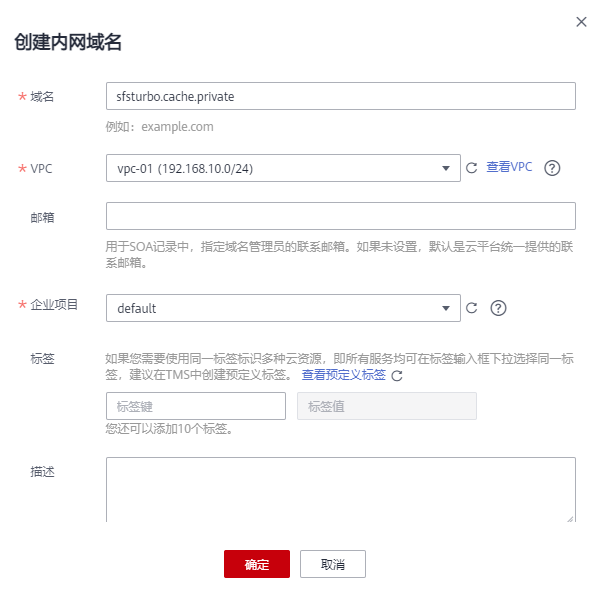
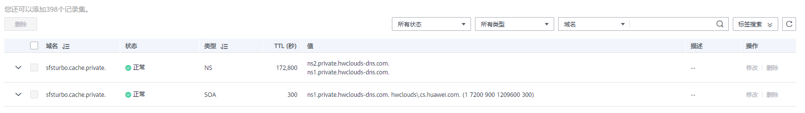
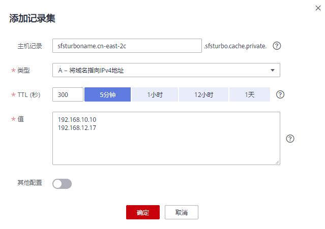
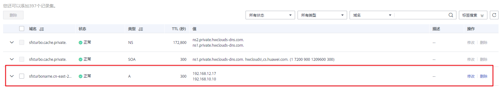

# SFS Turbo缓存型实例DNS配置

本章节介绍如何为SFS Turbo缓存型实例配置DNS。SFS Turbo缓存型实例需要正确配置DNS才可以使用。

## 操作步骤

1.  登录华为云控制台，选择“网络 \> 云解析服务DNS \> 域名解析 \> 内网解析。”
2.  单击右上角“创建内网域名”。如[图1](#fig118941843247)所示。

    **图 1**  创建内网域名  
    

    > **说明：** 
    >域名：填写域名名称（该域名要求没有被使用过），sfsturbo.cache.private为示例域名。
    >企业项目：选择和SFS Turbo缓存型文件系统相对应的VPC和企业项目。
    >具体参数配置可参考[创建内网域名](https://support.huaweicloud.com/usermanual-dns/zh-cn_topic_0057773658.html)。

3.  确认信息无误后，单击“确定”。
4.  单击创建后的域名，进入该域名的解析记录页面。如[图2](#fig89644168573)所示。

    **图 2**  查看域名  
    

5.  单击右上角“添加记录集”。配置记录集信息，如[图3](#fig123485321477)所示。

    **图 3**  添加记录集  
    

    > **说明：** 
    >主机记录：建议命名为\[SFS Turbo缓存型实例名称\].\[region\]。示例中“sfsturboname.cn-east-2c”表示SFS Turbo缓存型实例的名称为：sfsturboname，region为cn-east-2，c表示华东-上海二可用区3。
    >类型选择：A记录类型。
    >TTL：一般可为5分钟。
    >值：表示访问该域名后转发的目的服务器IP地址。这里根据实际创建SFS Turbo缓存型的服务器的地址来进行填写。

6.  确认配置信息无误后，单击“确定”。可以看到创建成功的记录集。

    **图 4**  成功创建记录集  
    

7.  创建成功后，可以通过域名sfsturboname.cn-east-2c.sfsturbo.cache.private进行挂载使用SFS Turbo缓存型文件系统。

