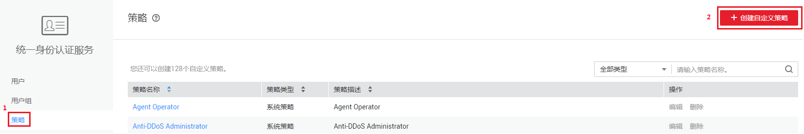
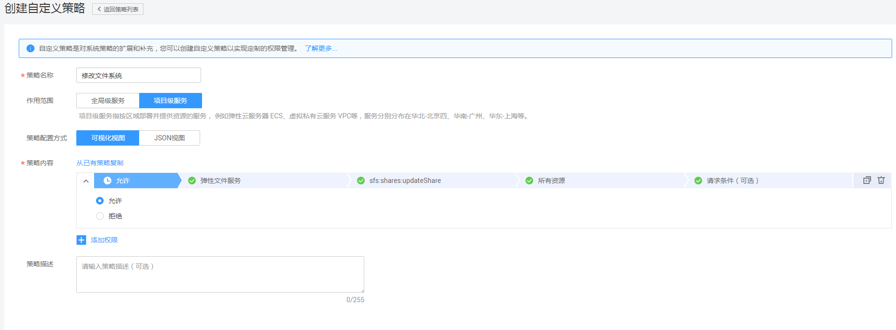
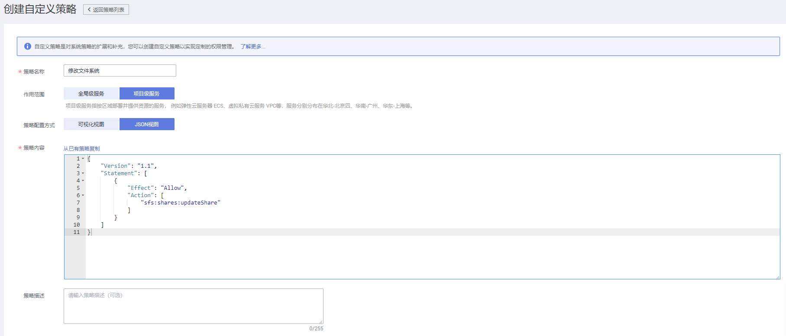

# 创建SFS自定义策略<a name="sfs-01-00000021"></a>

如果系统预置的SFS权限，不满足您的授权要求，可以创建自定义策略。自定义策略中可以添加的授权项（Action）请参考[策略及授权项说明](https://support.huaweicloud.com/api-sfs/zh-cn_topic_0136979281.html)。

目前华为云支持以下两种方式创建自定义策略：

-   可视化视图创建自定义策略：无需了解策略语法，按可视化视图导航栏选择云服务、操作、资源、条件等策略内容，可自动生成策略。
-   JSON视图创建自定义策略：可以在选择策略模板后，根据具体需求编辑策略内容；也可以直接在编辑框内编写JSON格式的策略内容。

如下以定制一个用户仅能修改文件系统的策略为例，分别采用可视化视图和JSON视图的配置方式创建自定义策略。

## 使用限制<a name="section8585832205518"></a>

因SFS Turbo文件系统不支持细粒度策略，所以创建的SFS自定义策略仅对SFS文件系统有效，对SFS Turbo文件系统无效。

## 前提条件<a name="section44121458131617"></a>

-   请先在IAM控制台中开通细粒度策略，开通方法请参见：[申请细粒度访问控制公测](https://support.huaweicloud.com/usermanual-iam/iam_01_019.html)。
-   如需使用JSON视图创建自定义策略，请您先熟悉策略结构，具体请参见[策略语法：细粒度策略](策略语法-细粒度策略.md)。
-   请确定自定义策略需要允许哪些操作，拒绝哪些操作，并获取操作对应的授权项。授权项请参见：[策略及授权项说明](https://support.huaweicloud.com/api-sfs/zh-cn_topic_0136979281.html)。

## 可视化视图配置自定义策略<a name="section46619625710"></a>

如下以创建名为“修改文件系统”的策略为例，创建一个仅支持修改文件系统的自定义策略。

1.  在IAM控制台，单击左侧导航栏的“策略”，在右上角选择“创建自定义策略”。

    **图 1**  创建自定义策略<a name="fig1412619010173"></a>  
    

2.  在“创建自定义策略”中，配置如下信息：

    **图 2**  可视化视图<a name="fig101577402169"></a>  
    

    -   “策略名称”：填写“修改文件系统”。
    -   “作用范围”：根据服务的属性填写，SFS为项目级服务，选择“项目级服务”。
    -   “策略配置方式”：选择可视化视图。
    -   “策略内容”：
        1.  选择“允许”。
        2.  在“云服务”中选择“弹性文件服务”。
        3.  在“操作”中勾选“ReadWrite”中的“sfs:shares:updateShare”，即“修改文件系统”。

    单击“确定”后，自定义策略创建成功。


## JSON视图配置自定义策略<a name="section19452176171717"></a>

如下以创建名为“修改文件系统”的策略为例，创建一个仅支持修改文件系统的自定义策略。

1.  在IAM控制台，单击左侧导航栏的“策略”，在右上角选择“创建自定义策略”。

    

2.  在“创建自定义策略”中，填写如下参数：

    **图 3**  修改文件系统<a name="fig95921245219"></a>  
    

    -   “策略名称”：填写“修改文件系统”。
    -   “作用范围”：根据服务的属性填写，SFS为项目级服务，选择“项目级服务”。
    -   “策略配置方式”：JSON视图。
    -   “策略信息”：将如下内容拷贝至策略信息中。如下策略表示允许修改文件系统。

        ```
        {
            "Version": "1.1",
            "Statement": [
                {
                    "Effect": "Allow",
                    "Action": [
                        "sfs:shares:updateShare"
                    ]
                }
            ]
        }
        ```

3.  单击“确定”后，系统会自动校验语法，如跳转到策略列表，则自定义策略创建成功；如提示“策略内容错误”，请按照语法规范进行修改。

## 验证自定义策略权限<a name="section11671215815"></a>

1.  将新创建的自定义策略授予用户组，使得用户组中的用户仅具备修改文件系统的权限。
2.  用户登录并验证自定义策略定义的权限：修改文件系统。

    权限授予成功后，用户可以通过控制台以及REST API等多种方式验证。此处以登录控制台为例，介绍用户如何验证修改文件系统的权限。

    1.  使用新创建的用户登录华为云，登录方法选择为“IAM用户登录”。
        -   账号名为该IAM用户所属华为云账号的名称。
        -   用户名和密码为账号在IAM创建用户时输入的用户名和密码。

    2.  在弹性文件服务页面，进行修改文件系统操作，操作成功，权限配置正确并已生效。
    3.  尝试进行其他操作，例如：删除文件系统

        系统显示“权限不足”，权限配置正确并已生效。


## 策略样例<a name="section2835114813515"></a>

-   示例1：授权用户创建文件系统。

    ```
    {
            "Version": "1.1",
            "Statement": [
                    {
                            "Action": [
                                    "sfs:shares:createShare"
                            ],
                            "Effect": "Allow"
                    }
            ]
    }
    ```

-   示例2：拒绝用户删除文件系统

    拒绝策略需要同时配合其他策略使用，否则没有实际作用。用户被授予的策略中，一个授权项的作用如果同时存在Allow和Deny，则遵循Deny优先。

    如果您给用户授予SFS Admin的系统策略，但不希望用户拥有SFS Admin中定义的删除文件系统权限，您可以创建一条拒绝删除文件系统的自定义策略，然后同时将SFS Admin和拒绝策略授予用户，根据Deny优先原则，则用户可以对SFS执行除了删除文件系统外的所有操作。拒绝策略示例如下：

    ```
    {
            "Version": "1.1",
            "Statement": [
                    {
                            "Effect": "Deny",
                            "Action": [
                                    "sfs:shares:deleteShare"
                            ]
                    }
            ]
    }
    ```


