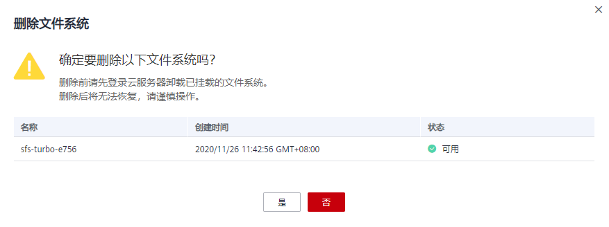

# 删除文件系统

文件系统删除后，文件系统中存放的数据将无法恢复。为避免数据丢失，执行删除操作前，请确认存放在该文件系统中的文件都已经在本地备份。

## 前提条件

删除文件系统之前，请先登录云服务器卸载已挂载的文件系统，Linux系统请参见[挂载NFS文件系统到云服务器（Linux）](https://support.huaweicloud.com/qs-sfs/zh-cn_topic_0034428728.html)中的“后续处理”小节，Windows系统请参见[挂载NFS文件系统到云服务器（Windows）](https://support.huaweicloud.com/qs-sfs/zh-cn_topic_0105224109.md)和[挂载CIFS文件系统到云服务器（Windows）](https://support.huaweicloud.com/qs-sfs/zh-cn_topic_0151246279.html)中的“后续处理”小节。

## 操作步骤

1.  登录管理控制台，选择“弹性文件服务“。
2.  在文件系统列表中，单击指定文件系统所在行的“删除”或“退订”。
3.  SFS容量型文件系统在[图1](#fig19966086153627)所示对话框中确认删除信息无误后，在文本框中输入“Delete”，最后单击“确定”。SFS Turbo文件系统退订后，根据界面提示完成退订操作。

    > **说明：**   
    >仅“可用”或“不可用”状态的文件系统才能被删除或退订。  

    **图 1**  删除文件系统  
    

4.  在文件系统列表中查看文件系统是否删除成功。
5.  （可选）如果需要同时删除多个文件系统，可勾选文件系统前选中多个文件系统，单击列表左上方“删除”，在弹出对话框中确认删除信息无误后，在文本框中输入“Delete”，最后单击“确定”。该操作仅限删除SFS容量型文件系统。

