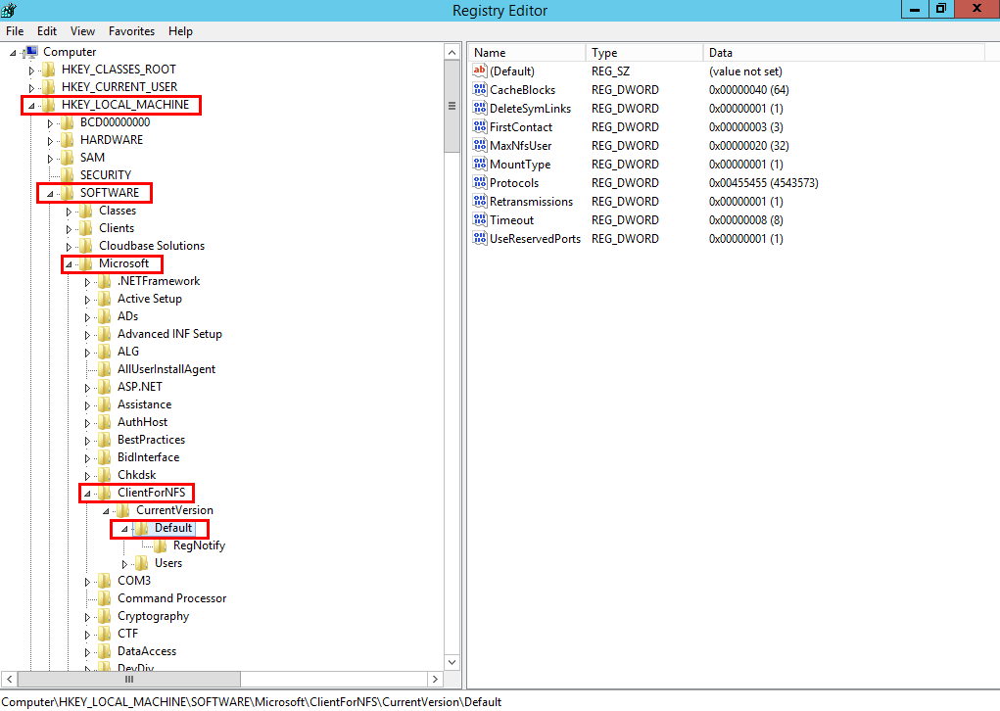
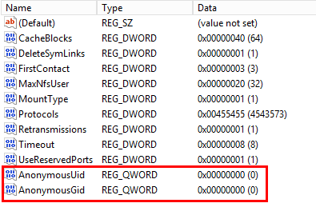

# 文件无法写入数据

## 现象描述

当将同一个文件系统分别挂载到已创建的Linux云服务器和Windows云服务器后，在Windows云服务器上无法对在Linux云服务器上创建的文件写入数据。

## 可能原因

由于共享的NFS文件系统归属于root权限，且无法修改该所属用户。当root权限的UID和GID分别为0时，才拥有写入权限。通过Windows命令查看，可以查到Windows是通过UID=-2的用户进行写入，故没有写入权限。

## 定位思路

需要通过修改注册表将Windows访问NFS时的UID和GID均修改为0。

## 解决方法

1.  在计算机“运行”中输入regedit，打开注册表编辑器。
2.  进入HKEY\_LOCAL\_MACHINE\\SOFTWARE\\Microsoft\\ClientForNFS\\CurrentVersion\\Default目录。如[图1](#fig103481655182917)所示。

    **图 1**  进入目录  
    

3.  右键选择“新建 \> QWORD值”，添加AnonymousUid，AnonymousGid两个值，设置值为0。如[图2](#fig56963212379)所示。

    **图 2**  添加值  
    

