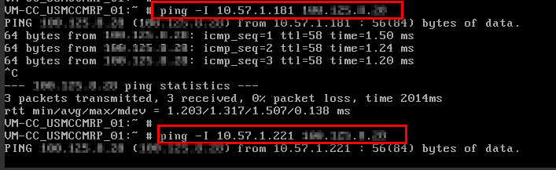

# 文件系统挂载失败

## 现象描述

使用mount命令挂载文件系统到云服务器，云服务器提示“access denied“，挂载失败。

## 可能原因

-   原因1：文件系统已被删除。
-   原因2：执行挂载命令的云服务器和被挂载的文件系统不在同一VPC下。
-   原因3：挂载命令中的共享路径输入错误。
-   原因4：使用虚拟IP访问弹性文件服务。
-   原因5：访问文件系统使用的DNS错误。

## 定位思路

根据可能原因进行故障排查。

## 解决办法

-   原因1：文件系统已被删除。

    登录管理控制台，查看文件系统是否已被删除。

    -   是 =\> 重新创建文件系统或者选择已有文件系统进行挂载（文件系统与云服务器必须归属在同一VPC下）。
    -   否 =\> 原因2。

-   原因2：执行挂载命令的云服务器和被挂载的文件系统不在同一VPC下。

    登录管理控制台，查看云服务器归属的VPC和文件系统归属的VPC是否相同。

    -   是 =\> 原因3。
    -   否 =\> 重新选择和云服务器相同VPC的文件系统进行挂载。

-   原因3：挂载命令中的共享路径输入错误。
    1.  登录管理控制台，查看共享路径是否与挂载命令中输入的一致。
    2.  如果输入错误，则重试挂载命令，输入正确的共享路径。

-   原因4：使用虚拟IP访问弹性文件服务。

    登录弹性云服务器，使用云服务器IP执行ping命令访问弹性文件服务，检测是否可以连通。如[图1](#fig1289720753914)所示。

    -   是 =\> 网络问题已解决，排查其他可能原因。
    -   否 =\> 由于网络问题，使用云服务器虚拟IP无法访问弹性文件服务，需使用私有IP执行ping命令访问弹性文件服务再检测是否可以连通。

        **图 1**  执行ping命令访问弹性文件服务  
        

-   原因5：访问文件系统使用的DNS错误。

    执行如下命令，确认DNS的正确性：

    **nslookup** _文件系统域名_

    确认解析出来的IP地址是否为100网段。

    -   是 =\> DNS配置正确，排查其他可能原因。
    -   否 =\> DNS配置不正确，请参考[配置DNS](配置DNS.md)章节重新配置DNS。

