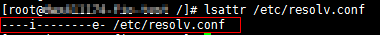

# 文件系统挂载超时<a name="ZH-CN_TOPIC_0037934210"></a>

## 现象描述<a name="section41158684111639"></a>

使用mount命令挂载文件系统到云服务器，云服务器系统提示“timed out“。

## 可能原因<a name="section31326994111720"></a>

-   原因1：网络状态不稳定。
-   原因2：网络连接异常。
-   原因3：云服务器DNS配置错误，导致解析不到文件系统的域名，挂载失败。

## 定位思路<a name="section34776262111735"></a>

排除网络问题后，重试挂载命令。

## 解决方法<a name="section31191225111737"></a>

1.  检查网络连接是否正常。
    -   是=\>  [2](#li50643641111816)。
    -   否=\> 修复网络，网络修复完成后执行[2](#li50643641111816)。

2.  <a name="li50643641111816"></a>登录文件系统挂载失败的云服务器。
3.  重新执行挂载命令。

    **mount -t nfs -o vers=3,timeo=600,nolock** _共享路径_  _本地路径_

    -   挂载成功。
    -   挂载失败=\>  [4](#li4567112215165)。

4.  <a name="li4567112215165"></a>确认租户DNS的配置，执行**cat /etc/resolv.conf**命令。
    -   如果没有配置DNS，需配置DNS。配置DNS请参见[配置DNS](配置DNS.md)。
    -   如果配置了DNS，需确认DNS的正确性，执行如下命令：

        **nslookup** _文件系统域名_

        如果解析出来的IP地址是100网段的，那么DNS配置正确，如果是其他网段的，那么DNS配置不正确。=\>[5](#li8526010134817)


5.  <a name="li8526010134817"></a>在云服务器修改配置文件“/etc/resolv.conf”配置正确的租户DNS，执行**vi /etc/resolv.conf**命令编辑“/etc/resolv.conf”文件。在已有的nameserver配置前写入DNS服务器的IP地址，DNS服务器东北区IP地址为100.125.6.250，其它区域详情请参见[华为云内网DNS地址](https://support.huaweicloud.com/dns_faq/dns_faq_002.html)。如[图1](#fig3735131720121)所示。

    **图 1**  配置DNS<a name="fig3735131720121"></a>  
    

    格式如下：

    ```
    nameserver 100.125.1.250
    nameserver 100.125.17.29
    ```

    -   编辑成功=\>  [6](#li75683251301)。
    -   编辑失败，执行**lsattr /etc/resolv.conf**命令，若回显如[图2](#fig46855620155120)所示信息，表明文件处于锁定状态。

        **图 2**  锁定状态的文件<a name="fig46855620155120"></a>  
        

        =\> 执行**chattr -i /etc/resolv.conf**命令，解锁文件。=\> 重新编辑=\>  [6](#li75683251301)。


6.  <a name="li75683251301"></a>单击“Esc”，并输入**:wq**，保存退出。
7.  由于租户申请的云服务器的默认DNS是从其所在的VPC继承过来的，所以每当云服务器重启的时候，会从VPC同步DNS。所以只修改云服务器的配置，只能解决当前问题。根本的解决问题，还需要在VPC中修改。 在云服务器所在的VPC的子网中设置正确的租户DNS，
8.  （可选）重新启动云服务器。

