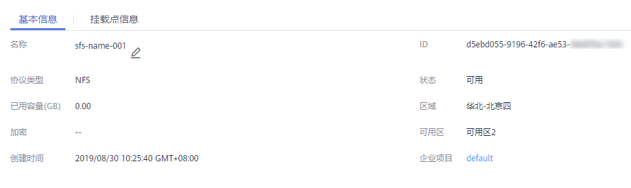

# 查看文件系统

查看文件系统的基本信息，支持按文件系统名称关键字、按文件系统状态等不同过滤条件查看指定的文件系统。

## 操作步骤

1.  登录管理控制台，选择“弹性文件服务“。
2.  在文件系统列表中查看所有文件系统的基本信息，参数说明如[表1](#table37365828114557)所示。

    **表 1**  参数说明

    
    <table><thead align="left"><tr id="row19122233114557"><th class="cellrowborder" valign="top" width="24.060000000000002%" id="mcps1.2.3.1.1">
参数

    </th>
    <th class="cellrowborder" valign="top" width="75.94%" id="mcps1.2.3.1.2">
说明

    </th>
    </tr>
    </thead>
    <tbody><tr id="row43511042114557"><td class="cellrowborder" valign="top" width="24.060000000000002%" headers="mcps1.2.3.1.1 ">
名称

    </td>
    <td class="cellrowborder" valign="top" width="75.94%" headers="mcps1.2.3.1.2 ">
已创建的文件系统名称，例如：sfs_share01。

    </td>
    </tr>
    <tr id="row38769363537"><td class="cellrowborder" valign="top" width="24.060000000000002%" headers="mcps1.2.3.1.1 ">
可用区

    </td>
    <td class="cellrowborder" valign="top" width="75.94%" headers="mcps1.2.3.1.2 ">
文件系统所在的可用区。

    </td>
    </tr>
    <tr id="row20691380114557"><td class="cellrowborder" valign="top" width="24.060000000000002%" headers="mcps1.2.3.1.1 ">
状态

    </td>
    <td class="cellrowborder" valign="top" width="75.94%" headers="mcps1.2.3.1.2 ">
文件系统的状态，包含“可用”、“不可用”、“已冻结”、“正在创建”、“正在删除”、“删除错误”、“正在扩容”、“扩容错误”、“正在缩容”、“缩容错误”和“缩容失败”。

    </td>
    </tr>
    <tr id="row14779614193918"><td class="cellrowborder" valign="top" width="24.060000000000002%" headers="mcps1.2.3.1.1 ">
类型

    </td>
    <td class="cellrowborder" valign="top" width="75.94%" headers="mcps1.2.3.1.2 ">
文件系统的类型，包含“SFS容量型”、“SFS Turbo标准型”和“SFS Turbo性能型”。

    </td>
    </tr>
    <tr id="row20249422122817"><td class="cellrowborder" valign="top" width="24.060000000000002%" headers="mcps1.2.3.1.1 ">
共享协议

    </td>
    <td class="cellrowborder" valign="top" width="75.94%" headers="mcps1.2.3.1.2 ">
文件系统的类型为NFS或CIFS。

    </td>
    </tr>
    <tr id="row31409628202754"><td class="cellrowborder" valign="top" width="24.060000000000002%" headers="mcps1.2.3.1.1 ">
可用容量(GB)

    </td>
    <td class="cellrowborder" valign="top" width="75.94%" headers="mcps1.2.3.1.2 ">
文件系统当前可以存放数据的剩余空间。

    
 说明： 

该数据不是实时数据，平均15分钟刷新一次。

    

    </td>
    </tr>
    <tr id="row38633965114557"><td class="cellrowborder" valign="top" width="24.060000000000002%" headers="mcps1.2.3.1.1 ">
总容量(GB)

    </td>
    <td class="cellrowborder" valign="top" width="75.94%" headers="mcps1.2.3.1.2 ">
文件系统的最大使用容量。

    </td>
    </tr>
    <tr id="row15695362119"><td class="cellrowborder" valign="top" width="24.060000000000002%" headers="mcps1.2.3.1.1 ">
是否加密

    </td>
    <td class="cellrowborder" valign="top" width="75.94%" headers="mcps1.2.3.1.2 ">
已经创建的文件系统的加密状态，包括“是”和“否”。

    </td>
    </tr>
    <tr id="row65429735114557"><td class="cellrowborder" valign="top" width="24.060000000000002%" headers="mcps1.2.3.1.1 ">
共享路径

    </td>
    <td class="cellrowborder" valign="top" width="75.94%" headers="mcps1.2.3.1.2 ">
文件系统的共享路径，NFS类型的格式为：文件系统域名:/路径，或文件系统IP:/；CIFS类型的格式为：\\文件系统域名:\路径。

    
 说明： 

由于共享路径名称较长，需要拉宽该栏以便完整显示。

    

    </td>
    </tr>
    <tr id="row27443506111522"><td class="cellrowborder" valign="top" width="24.060000000000002%" headers="mcps1.2.3.1.1 ">
操作

    </td>
    <td class="cellrowborder" valign="top" width="75.94%" headers="mcps1.2.3.1.2 ">
包含“容量调整”、续费”、“退订”和“删除”操作。

    </td>
    </tr>
    </tbody>
    </table>

3.  单击SFS容量型文件系统名称，可查看更多的文件系统信息，如[图1](#fig18803172318342)所示。

    **图 1**  文件系统的扩展信息  
    

4.  单击SFS Turbo文件系统名称，可查看更多的文件系统信息，如[图2](#fig465882013239)所示。

    可以在文件系统详情界面修改该文件系统的I/O模式，更改I/O模式时文件系统会在短暂时间内不可用，建议在无业务或业务量较小时操作。

    创建文件系统时默认同步（sync）。对于异步（async）挂载，客户端发送的写数据会先缓存在内存中，达到一定大小或者其他条件（与客户端设置，状态有关），再一起发往服务端。而同步（sync）挂载，每次发送的写数据则会马上发往服务端。如果存在多个客户端访问同一文件的情况，挂载时需要配置sync参数，避免客户端cache导致的数据一致性问题。

    **图 2**  Turbo文件系统的扩展信息  
    

5.  （可选）通过文件系统名称关键字、密钥ID或文件系统状态来过滤查看指定的文件系统。

