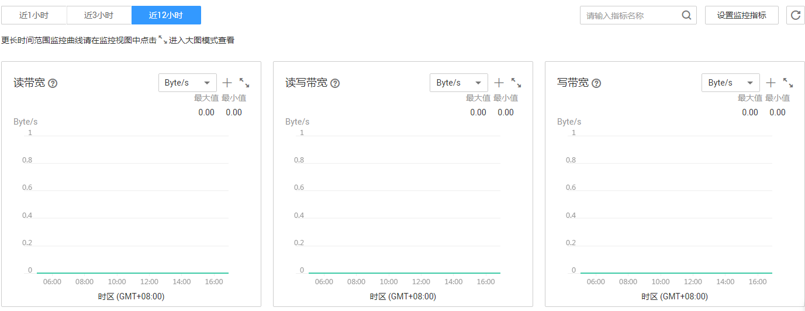

# 监控

## 操作场景

当用户开通了弹性文件服务后，无需额外安装其他插件，即可以使用云监控查看弹性文件服务的实际运行性能指标，弹性文件服务支持的监控指标如[表1](#table11517193051420)所示。

**表 1**  弹性文件服务支持的监控指标

<table><thead align="left"><tr id="row135208303144"><th class="cellrowborder" valign="top" width="25%" id="mcps1.2.5.1.1">
指标名称

</th>
<th class="cellrowborder" valign="top" width="25%" id="mcps1.2.5.1.2">
含义

</th>
<th class="cellrowborder" valign="top" width="25%" id="mcps1.2.5.1.3">
取值范围

</th>
<th class="cellrowborder" valign="top" width="25%" id="mcps1.2.5.1.4">
测量对象

</th>
</tr>
</thead>
<tbody><tr id="row9523130191417"><td class="cellrowborder" valign="top" width="25%" headers="mcps1.2.5.1.1 ">
读带宽

</td>
<td class="cellrowborder" valign="top" width="25%" headers="mcps1.2.5.1.2 ">
该指标用于统计测量对象在周期内的读数据量。

单位：字节/秒。

</td>
<td class="cellrowborder" valign="top" width="25%" headers="mcps1.2.5.1.3 ">
≥ 0 Byte/s

</td>
<td class="cellrowborder" valign="top" width="25%" headers="mcps1.2.5.1.4 ">
文件系统

</td>
</tr>
<tr id="row1152683018143"><td class="cellrowborder" valign="top" width="25%" headers="mcps1.2.5.1.1 ">
写带宽

</td>
<td class="cellrowborder" valign="top" width="25%" headers="mcps1.2.5.1.2 ">
该指标用于统计测量对象在周期内的写数据量。

单位：字节/秒。

</td>
<td class="cellrowborder" valign="top" width="25%" headers="mcps1.2.5.1.3 ">
≥ 0 Byte/s

</td>
<td class="cellrowborder" valign="top" width="25%" headers="mcps1.2.5.1.4 ">
文件系统

</td>
</tr>
<tr id="row145291730171417"><td class="cellrowborder" valign="top" width="25%" headers="mcps1.2.5.1.1 ">
读写带宽

</td>
<td class="cellrowborder" valign="top" width="25%" headers="mcps1.2.5.1.2 ">
该指标用于统计测量对象在周期内的读写数据量。

单位：字节/秒。

</td>
<td class="cellrowborder" valign="top" width="25%" headers="mcps1.2.5.1.3 ">
≥ 0 Byte/s

</td>
<td class="cellrowborder" valign="top" width="25%" headers="mcps1.2.5.1.4 ">
文件系统

</td>
</tr>
<tr id="row6730350112018"><td class="cellrowborder" valign="top" width="25%" headers="mcps1.2.5.1.1 ">
读OPS

</td>
<td class="cellrowborder" valign="top" width="25%" headers="mcps1.2.5.1.2 ">
该指标用于统计文件系统在周期内的读次数。

单位：次/秒。

</td>
<td class="cellrowborder" valign="top" width="25%" headers="mcps1.2.5.1.3 ">
≥ 0次/s

</td>
<td class="cellrowborder" valign="top" width="25%" headers="mcps1.2.5.1.4 ">
文件系统

</td>
</tr>
<tr id="row1468515228223"><td class="cellrowborder" valign="top" width="25%" headers="mcps1.2.5.1.1 ">
写OPS

</td>
<td class="cellrowborder" valign="top" width="25%" headers="mcps1.2.5.1.2 ">
该指标用于统计文件系统在周期内的写次数。

单位：次/秒。

</td>
<td class="cellrowborder" valign="top" width="25%" headers="mcps1.2.5.1.3 ">
≥ 0次/s

</td>
<td class="cellrowborder" valign="top" width="25%" headers="mcps1.2.5.1.4 ">
文件系统

</td>
</tr>
<tr id="row1165114543203"><td class="cellrowborder" valign="top" width="25%" headers="mcps1.2.5.1.1 ">
读写OPS

</td>
<td class="cellrowborder" valign="top" width="25%" headers="mcps1.2.5.1.2 ">
该指标用于统计文件系统在周期内的读写次数。

单位：次/秒。

</td>
<td class="cellrowborder" valign="top" width="25%" headers="mcps1.2.5.1.3 ">
≥ 0次/s

</td>
<td class="cellrowborder" valign="top" width="25%" headers="mcps1.2.5.1.4 ">
文件系统

</td>
</tr>
<tr id="row19579298212"><td class="cellrowborder" valign="top" width="25%" headers="mcps1.2.5.1.1 ">
已用容量

</td>
<td class="cellrowborder" valign="top" width="25%" headers="mcps1.2.5.1.2 ">
该指标用于统计文件系统在周期内的已用容量。

单位：Byte。

</td>
<td class="cellrowborder" valign="top" width="25%" headers="mcps1.2.5.1.3 ">
≥0 Byte

</td>
<td class="cellrowborder" valign="top" width="25%" headers="mcps1.2.5.1.4 ">
文件系统

</td>
</tr>
</tbody>
</table>

## 查看监控数据

1.  登录管理控制台。
2.  进入监控图表页面。
    -   入口一：选择“存储 \> 弹性文件服务”，在文件系统列表单击查看监控数据的文件系统“操作”列下的“查看监控指标”。
    -   入口二：选择“管理与部署 \> 云监控服务\> 云服务监控 \> 弹性文件服务”，在文件系统列表中，单击待查看监控数据的文件系统“操作”列下的“查看监控指标”。

3.  您可以选择监控指标项或者监控时间段，查看对应的弹性文件服务监控数据。

    具体如[图1](#fig54609244195032)所示，关于云监控的其他操作和更多信息，请参考《云监控用户指南》。

    **图 1**  监控图表  
    

