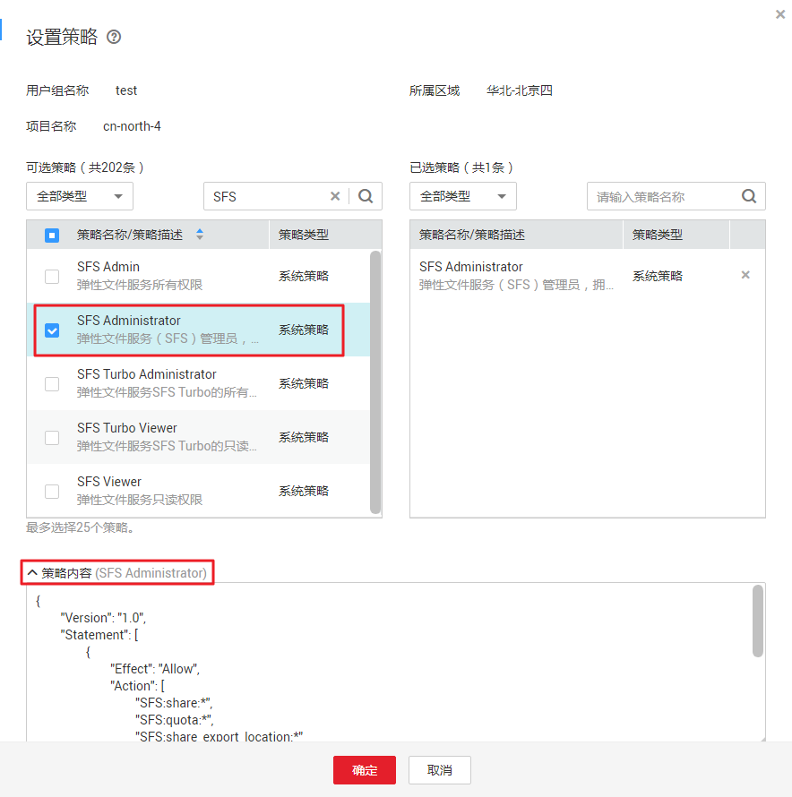

# 策略语法：RBAC<a name="sfs-01-00000023"></a>

## 策略语法<a name="section191115494557"></a>

给用户组选择策略时，单击策略下方的，可以查看策略的详细内容，以弹性文件服务的“SFS Administrator”策略为例，说明RBAC策略语法。

**图 1**  SFS Administrator策略内容<a name="fig99531619133312"></a>  


```
{
        "Version": "1.0",
        "Statement": [
                {
                        "Effect": "Allow",
                        "Action": [
                                "SFS:share:*",
                                "SFS:quota:*",
                                "SFS:share_export_location:*"
                        ]
                }
        ],
        "Depends": [
                {
                        "catalog": "BASE",
                        "display_name": "Tenant Guest"
                }
        ]
}
```

## 参数说明<a name="section1658273519470"></a>

-   Version：策略的版本号，RBAC策略版本为“1.0”，细粒度策略版本为“1.1”。
-   Statement：策略的授权语句，包含Action（授权项）和Effect（作用），Action和Effect结合构成用户具备的权限。
    -   Action（授权项）：操作权限，格式为：服务名:资源类型:操作

        "SFS:\*:\*"：表示对SFS的所有操作，其中SFS为服务名；“\*”为通配符，表示对所有的资源类型可以执行所有操作。

    -   Effect（作用）：定义Action中的操作权限是否允许执行。Allow：允许；Deny：拒绝。

-   Depends：策略的依赖关系，给用户组授予该策略时，需要同时勾选依赖的权限，否则该策略不会生效。
    -   catalog：依赖的策略的所属服务。
    -   display\_name：依赖的策略的名称，“SFS Administrator”依赖Base服务的“Tenant Guest”和“Tenant Administrator”策略。


