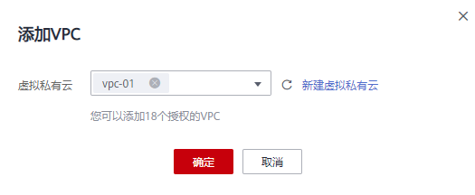

# 管理VPC

网络ACL是对一个或多个子网的访问控制策略系统，根据与子网关联的入站/出站规则，判断数据包是否被允许流入/流出关联子网。一个文件系统最多可以添加20个可用的VPC，对于添加的VPC所创建的ACL规则总和不能超过400个。添加VPC时会自动添加默认IP地址0.0.0.0/0。

如果已经在VPC控制台删除文件系统绑定的VPC，该VPC在文件系统绑定的VPC列表下可见且授权的IP地址/地址段为“激活”状态，但此时该VPC已无法进行使用，建议将该VPC从列表中删除。

更多关于VPC的信息请参见《虚拟私有云用户指南》。

目前仅SFS容量型文件系统支持对使用的VPC进行管理。

## 操作步骤

1.  登录管理控制台，选择“弹性文件服务“。
2.  在文件系统列表中单击目标SFS容量型文件系统名称，进入授权VPC界面。
3.  如果没有可用的VPC，需要先申请VPC。可以为文件系统添加多个VPC，单击“添加VPC”，弹出“添加VPC”对话框。如[图1](#fig625115289418)所示。

    可以在下拉列表中选中多个VPC。

    **图 1**  添加VPC  
    

4.  单击“确定“，完成添加。添加成功的VPC会出现在列表中，添加VPC时会自动添加默认IP地址0.0.0.0/0，默认读写权限为“读/写”，默认用户权限为“no\_all\_squash”，默认用户root权限为“no\_root\_squash”。
5.  在VPC列表下可以看到所有添加的VPC的信息，参数说明如[表1](#table99851739124510)所示。

    **表 1**  参数说明

    
    <table><thead align="left"><tr id="row18986439164514"><th class="cellrowborder" valign="top" width="27.889999999999997%" id="mcps1.2.3.1.1">
参数

    </th>
    <th class="cellrowborder" valign="top" width="72.11%" id="mcps1.2.3.1.2">
说明

    </th>
    </tr>
    </thead>
    <tbody><tr id="row159865391455"><td class="cellrowborder" valign="top" width="27.889999999999997%" headers="mcps1.2.3.1.1 ">
名称

    </td>
    <td class="cellrowborder" valign="top" width="72.11%" headers="mcps1.2.3.1.2 ">
已添加的VPC的名称，例如：vpc-4040。

    </td>
    </tr>
    <tr id="row1398615399451"><td class="cellrowborder" valign="top" width="27.889999999999997%" headers="mcps1.2.3.1.1 ">
授权IP数量

    </td>
    <td class="cellrowborder" valign="top" width="72.11%" headers="mcps1.2.3.1.2 ">
已经添加的IP地址或IP地址段的个数。

    </td>
    </tr>
    <tr id="row498693904514"><td class="cellrowborder" valign="top" width="27.889999999999997%" headers="mcps1.2.3.1.1 ">
操作

    </td>
    <td class="cellrowborder" valign="top" width="72.11%" headers="mcps1.2.3.1.2 ">
包含“添加”和“删除”操作。“添加”即添加授权的IP地址，包括对授权的IP地址、读/写权限、用户权限、用户root权限及优先级的设置，请参见<a href="#table1242824684814">表2</a>。“删除”即删除该VPC。

    </td>
    </tr>
    </tbody>
    </table>

6.  单击VPC名称左边的，可以查看目标VPC添加的IP地址/地址段的详细信息。可以对其进行添加、编辑和删除IP地址/地址段的操作。在目标VPC的“操作“列，单击“添加“，弹出“添加授权地址”的弹窗，如[图2](#fig87801322188)所示。可以根据参数说明如[表2](#table1242824684814)所示完成添加。

    **图 2**  添加授权地址  
    

    **表 2**  参数说明

    
    <table><thead align="left"><tr id="row18428154644810"><th class="cellrowborder" valign="top" width="25%" id="mcps1.2.3.1.1">
参数

    </th>
    <th class="cellrowborder" valign="top" width="75%" id="mcps1.2.3.1.2">
说明

    </th>
    </tr>
    </thead>
    <tbody><tr id="row242814617489"><td class="cellrowborder" valign="top" width="25%" headers="mcps1.2.3.1.1 ">
授权地址

    </td>
    <td class="cellrowborder" valign="top" width="75%" headers="mcps1.2.3.1.2 "><ul id="ul13324116192216"><li>只能输入一个IPv4地址/地址段。</li><li>输入的IPv4地址/地址段必须合法，且不能为除0.0.0.0/0以外之前0开头的IP地址或地址段，其中当设置为0.0.0.0/0时表示VPC内的任意IP。同时，不能为127以及224~255开头的IP地址或地址段，例如127.0.0.1，224.0.0.1，255.255.255.255，因为以224-239开头的IP地址或地址段是属于D类地址，用于组播；以240-255开头的IP地址或地址段属于E类地址，用于研究。使用非合法的IP或IP地址段可能会导致添加访问规则失败或者添加的访问规则无法生效。</li><li>无法输入多个地址，如：10.0.1.32,10.5.5.10用逗号分隔等形式的多个地址。</li><li>如果要表示一个地址段，如192.168.1.0-192.168.1.255的地址段应使用掩码形式：192.168.1.0/24，不支持192.168.1.0-255等其他地址段表示形式。掩码位数的取值为0到31的整数，且只有为0.0.0.0/0时掩码位数可取0，其他情况均不合法。</li></ul>
    </td>
    </tr>
    <tr id="row144285465480"><td class="cellrowborder" valign="top" width="25%" headers="mcps1.2.3.1.1 ">
读或写权限

    </td>
    <td class="cellrowborder" valign="top" width="75%" headers="mcps1.2.3.1.2 ">
分为读/写权限和只读权限。默认为“读/写”。

    </td>
    </tr>
    <tr id="row4428104634818"><td class="cellrowborder" valign="top" width="25%" headers="mcps1.2.3.1.1 ">
用户权限

    </td>
    <td class="cellrowborder" valign="top" width="75%" headers="mcps1.2.3.1.2 ">
分为all_squash和no_all_squash。默认为“no_all_squash”。

    
CIFS类型的文件系统添加授权地址时，不涉及该参数。

    </td>
    </tr>
    <tr id="row1942884614813"><td class="cellrowborder" valign="top" width="25%" headers="mcps1.2.3.1.1 ">
用户root权限

    </td>
    <td class="cellrowborder" valign="top" width="75%" headers="mcps1.2.3.1.2 ">
分为root_squash和no_root_squash。默认为“no_root_squash”。

    
CIFS类型的文件系统添加授权地址时，不涉及该参数。

    </td>
    </tr>
    <tr id="row144282465483"><td class="cellrowborder" valign="top" width="25%" headers="mcps1.2.3.1.1 ">
优先级

    </td>
    <td class="cellrowborder" valign="top" width="75%" headers="mcps1.2.3.1.2 ">
优先级只能是0-100的整数。0表示优先级最高，100表示优先级最低。同一VPC内挂载时会优先使用该优先级高的IP地址/地址段所拥有的权限，存在相同优先级时会优先匹配最新添加或修改的IP地址/地址段。例如：用户在执行挂载操作时的IP地址为10.1.1.32，而在已经授权的IP地址/地址段中10.1.1.32（读写）优先级为100和10.1.1.0/24（只读）优先级为50均符合要求，则用户权限会使用优先级为50的10.1.1.0/24（只读）的只读权限。10.1.1.0/24内的所有地址包括10.1.1.32，在无其他授权优先级的情况下，则将会使用优先级为50的10.1.1.0/24（只读）的只读权限。

    </td>
    </tr>
    </tbody>
    </table>

    > **说明：**   
    >属于VPC A中的弹性云服务器IP地址可以被成功添加至VPC B的授权IP地址内，但该云服务器无法挂载属于VPC B下的文件系统。弹性云服务器和文件系统所使用的VPC需为同一个。  

