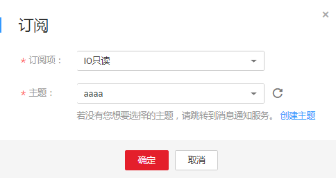

# 管理文件系统订阅

消息通知服务（Simple Message Notification，SMN）是可靠的、可扩展的、海量的消息处理服务。它可以依据用户的需求主动推送通知消息，最终用户可以通过短信、电子邮件、应用等方式接收。

订阅是您将订阅者注册到主题的操作。要接收发布至主题的消息，您必须订阅一个订阅终端到该主题。终端节点可以是手机号码、邮件地址、函数、平台应用的终端、DMS或HTTP\(S\)终端。为终端节点订阅主题且确认订阅后，终端节点能够接收到向该主题发布的所有消息。

更多关于SMN的信息请参见《消息通知服务用户指南》。

## 添加订阅

1.  登录管理控制台，选择“弹性文件服务“。
2.  在文件系统列表中，找到待添加订阅的SFS Turbo文件系统并单击目标文件系统名称，进入文件系统详情界面。
3.  在“订阅管理“页签，单击“添加订阅“。如[图1](#fig235994321310)所示。

    **图 1**  添加订阅  
    

4.  在下拉列表中，选择已创建的订阅项和主题。若需要选择的主题未在列表中，需要前往消息通知服务进行创建。具体操作步骤请参见《消息通知服务》用户指南。
5.  单击“确定“。创建成功后可在订阅列表中查看。

    若不再需要相关订阅，单击目标订阅“操作”列下的“删除“即可。

