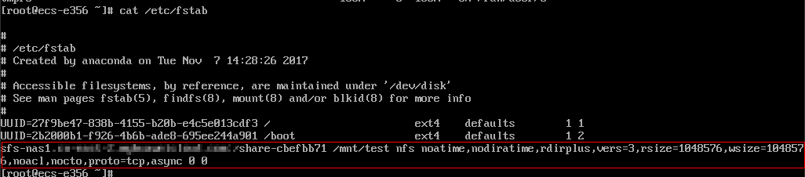

# 自动挂载文件系统<a name="ZH-CN_TOPIC_0072155931"></a>

为避免已挂载文件系统的云服务器重启后，挂载信息丢失，您可以在云服务器设置重启时进行自动挂载。

## Linux系统操作步骤<a name="section38954620214447"></a>

1.  以root用户登录云服务器。
2.  执行**vi /etc/fstab**命令编辑“/etc/fstab”文件。

    在文件的最后新增要挂载的文件系统信息，配置样例如下：

    ```
    example.com:/share-xxx /local_path nfs vers=3,timeo=600,nolock 0 0
    ```

    其中，“_example.com:/share-xxx_”和“_/local\_path_”需根据实际情况进行修改。/etc/fstab文件中每条记录对应一个挂载信息，每条记录有6个字段，对应的字段说明请参见[字段说明](#section241009011643)。

    > **注意：**   
    >为获得最优的系统性能，建议按照“配置样例”进行配置。若业务需要，您也可以根据实际情况自定义部分挂载参数，但变更配置后将会在一定程度上影响系统性能。  

3.  单击“Esc”，并输入**:wq**，保存文件并退出。

    完成上述配置后，当云服务器重启时，系统会从/etc/fstab文件中读取挂载信息，完成文件系统的自动挂载。

4.  （可选）执行以下命令，查看修改后的fstab文件内容。

    **cat /etc/fstab**

    修改后的fstab文件内容如[图1](#fig1023252822220)所示。

    **图 1**  修改后的fstab文件<a name="fig1023252822220"></a>  
    


## 字段说明<a name="section241009011643"></a>

挂载信息的字段说明如[表 1 字段说明](#table215511301179)所示。

**表 1**  字段说明

<a name="table215511301179"></a>
<table><thead align="left"><tr id="zh-cn_topic_0072155931_row1990488511206"><th class="cellrowborder" valign="top" width="20%" id="mcps1.2.3.1.1"><p id="zh-cn_topic_0072155931_p168295211206"><a name="zh-cn_topic_0072155931_p168295211206"></a><a name="zh-cn_topic_0072155931_p168295211206"></a>字段</p>
</th>
<th class="cellrowborder" valign="top" width="80%" id="mcps1.2.3.1.2"><p id="zh-cn_topic_0072155931_p210146111206"><a name="zh-cn_topic_0072155931_p210146111206"></a><a name="zh-cn_topic_0072155931_p210146111206"></a>说明</p>
</th>
</tr>
</thead>
<tbody><tr id="zh-cn_topic_0072155931_row3037087111206"><td class="cellrowborder" valign="top" width="20%" headers="mcps1.2.3.1.1 "><p id="zh-cn_topic_0072155931_p4412150111206"><a name="zh-cn_topic_0072155931_p4412150111206"></a><a name="zh-cn_topic_0072155931_p4412150111206"></a><em id="i4077341814844"><a name="i4077341814844"></a><a name="i4077341814844"></a>example.com:/share-xxx</em></p>
</td>
<td class="cellrowborder" valign="top" width="80%" headers="mcps1.2.3.1.2 "><p id="zh-cn_topic_0072155931_p1707183511206"><a name="zh-cn_topic_0072155931_p1707183511206"></a><a name="zh-cn_topic_0072155931_p1707183511206"></a>挂载对象，即要挂载的文件系统的共享路径。设置为<a href="https://support.huaweicloud.com/qs-sfs/zh-cn_topic_0034428728.html" target="_blank" rel="noopener noreferrer">挂载文件系统到云服务器</a>中mount命令中的共享路径。</p>
</td>
</tr>
<tr id="zh-cn_topic_0072155931_row3259701211206"><td class="cellrowborder" valign="top" width="20%" headers="mcps1.2.3.1.1 "><p id="zh-cn_topic_0072155931_p2311233111206"><a name="zh-cn_topic_0072155931_p2311233111206"></a><a name="zh-cn_topic_0072155931_p2311233111206"></a><em id="i272352251490"><a name="i272352251490"></a><a name="i272352251490"></a>/local_path</em></p>
</td>
<td class="cellrowborder" valign="top" width="80%" headers="mcps1.2.3.1.2 "><p id="zh-cn_topic_0072155931_p6015955111206"><a name="zh-cn_topic_0072155931_p6015955111206"></a><a name="zh-cn_topic_0072155931_p6015955111206"></a>挂载点，即云服务器上创建的挂载文件系统的目录。设置为<a href="https://support.huaweicloud.com/qs-sfs/zh-cn_topic_0034428728.html" target="_blank" rel="noopener noreferrer">挂载文件系统到云服务器</a>中mount命令中的本地路径。</p>
</td>
</tr>
<tr id="zh-cn_topic_0072155931_row2074966211206"><td class="cellrowborder" valign="top" width="20%" headers="mcps1.2.3.1.1 "><p id="zh-cn_topic_0072155931_p300108911206"><a name="zh-cn_topic_0072155931_p300108911206"></a><a name="zh-cn_topic_0072155931_p300108911206"></a>nfs</p>
</td>
<td class="cellrowborder" valign="top" width="80%" headers="mcps1.2.3.1.2 "><p id="zh-cn_topic_0072155931_p4176163611206"><a name="zh-cn_topic_0072155931_p4176163611206"></a><a name="zh-cn_topic_0072155931_p4176163611206"></a>挂载类型，指文件系统或分区类型。本节描述的是挂载文件系统，设置为nfs。</p>
</td>
</tr>
<tr id="zh-cn_topic_0072155931_row4391735511206"><td class="cellrowborder" valign="top" width="20%" headers="mcps1.2.3.1.1 "><p id="p34504224917"><a name="p34504224917"></a><a name="p34504224917"></a>vers=3,timeo=600,nolock 0 0</p>
</td>
<td class="cellrowborder" valign="top" width="80%" headers="mcps1.2.3.1.2 "><p id="zh-cn_topic_0072155931_p4341916611206"><a name="zh-cn_topic_0072155931_p4341916611206"></a><a name="zh-cn_topic_0072155931_p4341916611206"></a>挂载选项，用于设置挂载的参数，多个选项之间以逗号进行分隔。</p>
</td>
</tr>
</tbody>
</table>

## Windows系统操作步骤<a name="section6323162217518"></a>

目标服务器需已成功安装NFS客户端，本操作以Windows 2012为例进行描述。

1.  在Windows系统挂载前，需要先创建名为auto\_mount.bat的脚本，并保存至本地，记录保存路径。脚本中包含以下内容：

    ```
    mount -o nolock 共享路径 对应盘符
    ```

    例如，某文件系统的auto\_mount.bat脚本内容为：mount -o nolock sfs.nas1.xxx.com/share-xxx X:

    > **说明：**   
    >建议在脚本创建完成后，在CMD下手动执行确保脚本可以正常执行成功。  

2.  创建一个名称为_XXX_.vbs，“保存类型”为“所有文件”的txt文档，并保存到“C:\\Users\\Administrator\\AppData\\Roaming\\Microsoft\\Windows\\「开始」菜单\\程序\\启动”路径下。该txt文档中包含以下内容：

    ```
    set ws=WScript.CreateObject("WScript.Shell") 
    ws.Run "auto_mount.bat脚本的本地路径 /start",0
    ```

3.  完成创建后，可以重启服务器进行验证。

