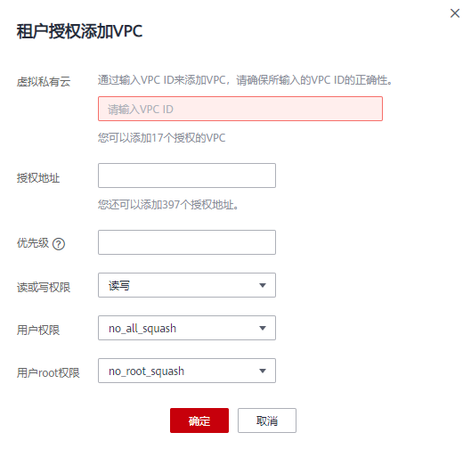

# 配置多帐号访问

## 操作场景

SFS容量型文件系统除了支持多VPC访问，还支持跨帐号跨VPC访问。

只要将其他帐号使用的VPC的VPC ID添加到文件系统的VPC列表下，且云服务器IP地址或地址段被添加至授权地址中，则实际上不同帐号间归属于不同VPC的云服务器也能共享访问同一个文件系统。

更多关于VPC的信息请参见[虚拟私有云 VPC](https://support.huaweicloud.com/vpc/index.html)。

SFS Turbo文件系统基于VPC的对等连接功能，实现跨帐号访问。更多关于VPC对等连接功能信息和实现方法请参见[VPC对等连接](https://support.huaweicloud.com/usermanual-vpc/zh-cn_topic_0046655036.html)。

本章节介绍SFS容量型文件系统如何实现跨帐号跨VPC访问。目前仅北京四支持跨帐号访问功能。

## 使用限制

-   一个文件系统最多可以添加20个可用的VPC，对于添加的VPC所创建的ACL规则总和不能超过400个。
-   如果已经在VPC控制台删除文件系统绑定的VPC，该VPC在文件系统绑定的VPC列表下可见且授权的IP地址/地址段为“激活”状态，但此时该VPC已无法进行使用，建议将该VPC从列表中删除。

## 操作步骤

1.  登录弹性文件服务管理控制台。
2.  在文件系统列表中单击目标文件系统名称，进入授权VPC界面。
3.  可以为文件系统添加多个其他帐号使用的VPC，单击“租户授权添加VPC”，弹出“租户授权添加VPC”对话框。如[图1](#fig1575172713538)所示。

    **图 1**  租户授权添加VPC  
    

    可以根据参数说明如[表1](#table1242824684814)所示完成添加。

    **表 1**  参数说明

    
    <table><thead align="left"><tr id="row18428154644810"><th class="cellrowborder" valign="top" width="25%" id="mcps1.2.3.1.1">
参数

    </th>
    <th class="cellrowborder" valign="top" width="75%" id="mcps1.2.3.1.2">
说明

    </th>
    </tr>
    </thead>
    <tbody><tr id="row18109141916466"><td class="cellrowborder" valign="top" width="25%" headers="mcps1.2.3.1.1 ">
虚拟私有云

    </td>
    <td class="cellrowborder" valign="top" width="75%" headers="mcps1.2.3.1.2 ">
添加VPC的VPC ID。VPC ID可以前往虚拟私有云控制台，查看目标VPC详情获取。

    </td>
    </tr>
    <tr id="row242814617489"><td class="cellrowborder" valign="top" width="25%" headers="mcps1.2.3.1.1 ">
授权地址

    </td>
    <td class="cellrowborder" valign="top" width="75%" headers="mcps1.2.3.1.2 "><ul id="ul13324116192216"><li>只能输入一个IPv4地址/地址段。</li><li>输入的IPv4地址/地址段必须合法，且不能为除0.0.0.0/0以外之前0开头的IP地址或地址段，其中当设置为0.0.0.0/0时表示VPC内的任意IP。同时，不能为127以及224~255开头的IP地址或地址段，例如127.0.0.1，224.0.0.1，255.255.255.255，因为以224-239开头的IP地址或地址段是属于D类地址，用于组播；以240-255开头的IP地址或地址段属于E类地址，用于研究。使用非合法的IP或IP地址段可能会导致添加访问规则失败或者添加的访问规则无法生效。</li><li>无法输入多个地址，如：10.0.1.32,10.5.5.10用逗号分隔等形式的多个地址。</li><li>如果要表示一个地址段，如192.168.1.0-192.168.1.255的地址段应使用掩码形式：192.168.1.0/24，不支持192.168.1.0-255等其他地址段表示形式。掩码位数的取值为0到31的整数，且只有为0.0.0.0/0时掩码位数可取0，其他情况均不合法。</li></ul>
    </td>
    </tr>
    <tr id="row120914378461"><td class="cellrowborder" valign="top" width="25%" headers="mcps1.2.3.1.1 ">
优先级

    </td>
    <td class="cellrowborder" valign="top" width="75%" headers="mcps1.2.3.1.2 ">
优先级只能是0-100的整数。0表示优先级最高，100表示优先级最低。同一VPC内挂载时会优先使用该优先级高的IP地址/地址段所拥有的权限，存在相同优先级时会优先匹配最新添加或修改的IP地址/地址段。例如：用户在执行挂载操作时的IP地址为10.1.1.32，而在已经授权的IP地址/地址段中10.1.1.32（读写）优先级为100和10.1.1.0/24（只读）优先级为50均符合要求，则用户权限会使用优先级为50的10.1.1.0/24（只读）的只读权限。10.1.1.0/24内的所有地址包括10.1.1.32，在无其他授权优先级的情况下，则将会使用优先级为50的10.1.1.0/24（只读）的只读权限。

    </td>
    </tr>
    <tr id="row144285465480"><td class="cellrowborder" valign="top" width="25%" headers="mcps1.2.3.1.1 ">
读或写权限

    </td>
    <td class="cellrowborder" valign="top" width="75%" headers="mcps1.2.3.1.2 ">
分为读/写权限和只读权限。默认为“读/写”。

    </td>
    </tr>
    <tr id="row4428104634818"><td class="cellrowborder" valign="top" width="25%" headers="mcps1.2.3.1.1 ">
用户权限

    </td>
    <td class="cellrowborder" valign="top" width="75%" headers="mcps1.2.3.1.2 ">
设置是否保留共享目录的UID和GID。默认为“no_all_squash”。

    <ul id="ul1829105884712"><li>all_squash：共享文件的UID（User ID）和GID（Group ID）映射给nobody用户，适合公共目录。</li><li>no_all_squash：保留共享文件的UID和GID。</li></ul>
    
CIFS类型的文件系统添加授权地址时，不涉及该参数。

    </td>
    </tr>
    <tr id="row1942884614813"><td class="cellrowborder" valign="top" width="25%" headers="mcps1.2.3.1.1 ">
用户root权限

    </td>
    <td class="cellrowborder" valign="top" width="75%" headers="mcps1.2.3.1.2 ">
设置是否允许客户端的root权限。默认为“no_root_squash”。

    <ul id="ul202950116498"><li>root_squash：不允许客户端以root用户访问，客户端使用root用户访问时映射为nobody用户。</li><li>no_root_squash：允许客户端以root用户访问，root用户具有根目录的完全控制访问权限。</li></ul>
    
CIFS类型的文件系统添加授权地址时，不涉及该参数。

    </td>
    </tr>
    </tbody>
    </table>

4.  单击“确定“，完成添加。添加成功的VPC会出现在列表中。
5.  单击VPC名称左边的，可以查看目标VPC添加的IP地址/地址段的详细信息。可以对其进行添加、编辑和删除IP地址/地址段的操作。在目标VPC的“操作“列，单击“添加“，弹出“添加授权地址”的弹窗，如[图2](#fig87801322188)所示。可以根据参数说明如[表1](#table1242824684814)所示完成添加。

    **图 2**  增加授权地址  
    

## 验证

将其他用户的VPC ID添加至文件系统后，如果文件系统能够成功挂载其他用户该VPC下的云服务器，云服务器能够访问文件系统，则表示配置成功。

